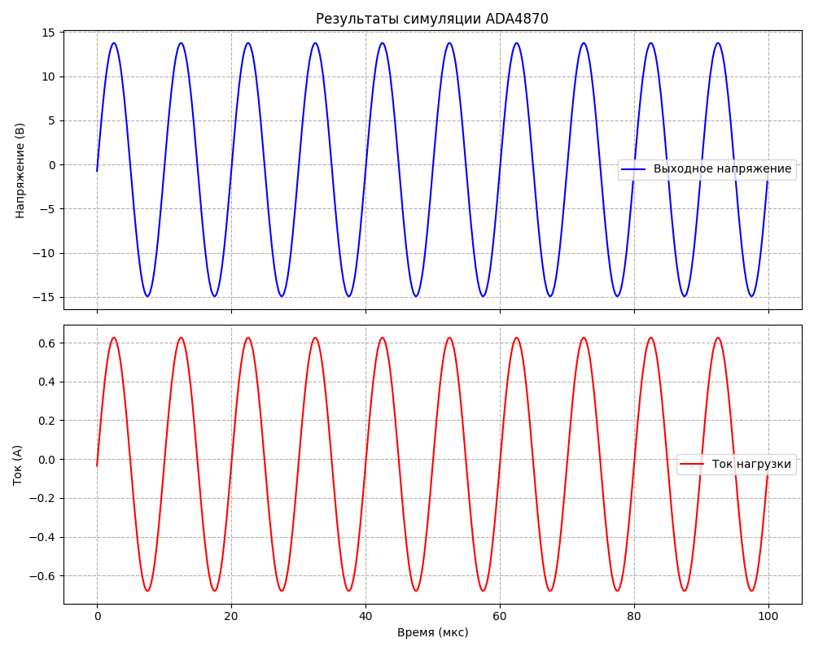
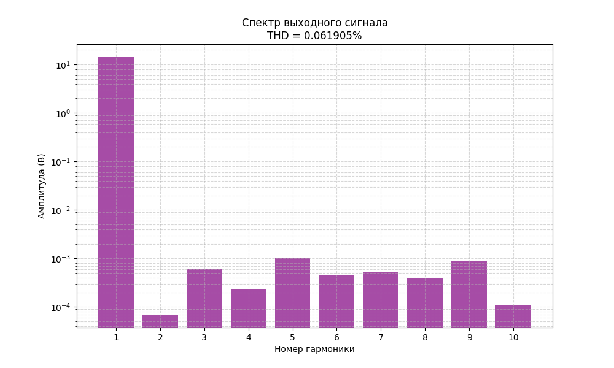
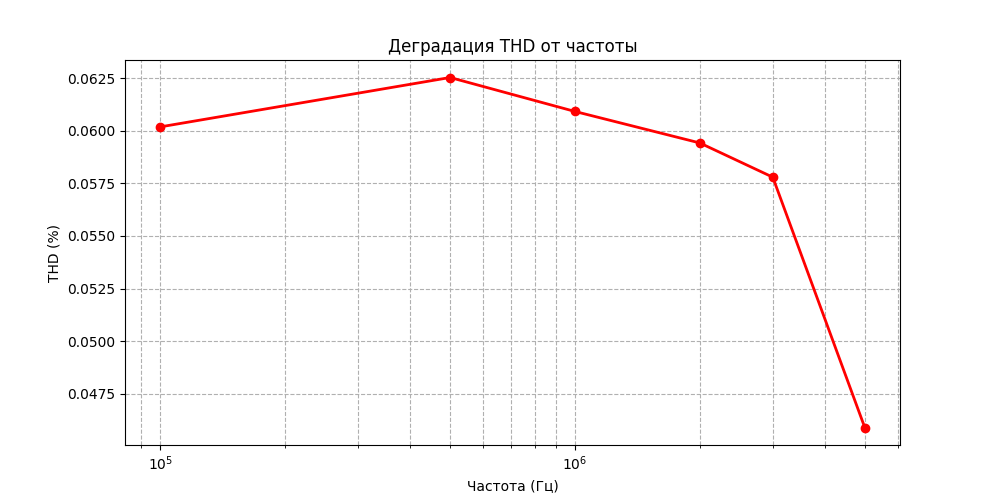

# ADA4870 Output Stage Design Tool

Инженерный инструмент для подбора номиналов выходного каскада на базе усилителя **ADA4870** с предусилителями **ADA4807-2**, работающего от ЦАП **AD9705**. Проект выполняет расчёт резисторов \(R_f\), \(R_a\), \(R_b\) и конденсатора \(C_f\) по заданным требованиям, автоматически запускает симуляцию в LTspice, анализирует искажения и генерирует отчёт с графиками.

---

## Содержание

- [Возможности](#возможности)
- [Требования и установка](#требования-и-установка)
- [Структура проекта](#структура-проекта)
- [Конфигурация (config.json)](#конфигурация-configjson)
- [Алгоритм подбора номиналов](#алгоритм-подбора-номиналов)
    - [Исходные данные](#исходные-данные)
    - [Шаги расчёта](#шаги-расчёта)
    - [Критерий выбора лучшей комбинации](#критерий-выбора-лучшей-комбинации)
    - [Рекомендованные значения \(R_f\) (из даташита ADA4870)](#рекомендованные-значения-r_f-из-даташита-ada4870)
- [Запуск](#запуск)
- [Результаты работы](#результаты-работы)
- [Расширенные возможности](#расширенные-возможности)
- [Лицензия](#лицензия)

---

## Возможности

- **Автоматизированный расчёт** номиналов \(R_a, R_f, R_b, C_f\) по заданным \(V_{out\_amp}, I_{FS}, R_{load}\) и ограничениям.
- **Округление до стандартного ряда E96 (1%)** – все резисторы можно купить.
- **Балансировка входных токов** – минимизация постоянного смещения на выходе.
- **Симуляция в LTspice** с автоматической подстановкой рассчитанных значений.
- **Фурье-анализ (THD)** и построение спектра гармоник.
- **Визуализация** сигналов и тока нагрузки.
- **Генерация текстового отчёта** с ключевыми параметрами.
- **Детальное логирование** всех этапов.

---

## Требования и установка

### Зависимости

- Python 3.9+
- [PyLTSpice](https://github.com/nunobrum/PyLTSpice) – управление LTspice из Python.
- LTspice (установленный отдельно, путь указывается в конфиге).
- Стандартные библиотеки: `numpy`, `pandas`, `matplotlib`, `re`, `math`, `json`, `logging`, `pathlib`.

Установка Python-зависимостей:

```bash
pip install PyLTSpice pandas matplotlib
```

### LTspice

Скачайте LTspice с [официального сайта Analog Devices](https://www.analog.com/en/design-center/design-tools-and-calculators/ltspice-simulator.html).  
Запомните путь к исполняемому файлу (например, `C:\Program Files\ADI\LTspice\LTspice.exe`) – он понадобится в `config.json`.

---

## Структура проекта

```
project/
├── main.py                 # точка входа и сценарий
├── calculation.py          # расчёт номиналов (E96, подбор)
├── simulation.py           # обёртка PyLTSpice
├── plotting.py             # визуализация (matplotlib)
├── report.py               # генерация текстового отчёта
├── logger_config.py        # настройка логирования
├── config.json             # все параметры по умолчанию
├── ada4807_4870.asc        # схема LTSpice
├── out/                    # выходные файлы (CSV, отчёты)
│   └── ...
├── temp/                   # временные файлы симуляции (.raw, .log)
└── simulation.log          # подробный лог выполнения
```

---

## Конфигурация (config.json)

Файл содержит три основные секции:

```json
{
    "schematic": {
        "path": "ada4807_4870.asc"
    },
    "ltspice": {
        "executable": "C:\\Program Files\\ADI\\LTspice\\LTspice.exe"
    },
    "simulation": {
        "output_dir": "./out",
        "temp_dir": "./temp"
    },
    "params": {
        "I_FS": 0.004,
        "R_TIA": 249,
        "V_out_amp": 14.0,
        "R_load": 22,
        "V_sup": 18,
        "V_headroom": 2.0,
        "I_out_max": 1.0,
        "Rf_max": 10000,
        "Ra_candidates": [50, 75, 100, 120, 150, 200],
        "Cf_base": 2e-12,
        "Cf_per_kohm": 0.5e-12,
        "Rf_threshold": 1000
    },
    "frequencies": [100000, 500000, 1000000, 2000000, 3000000, 5000000]
}
```

**Описание параметров**:
- `I_FS` – ток полной шкалы ЦАП (А).
- `R_TIA` – сопротивление обратной связи трансимпедансных усилителей (Ом).
- `V_out_amp` – требуемая амплитуда выходного напряжения (В).
- `R_load` – сопротивление нагрузки (Ом).
- `V_sup`, `V_headroom`, `I_out_max` – ограничения питания и тока.
- `Ra_candidates` – список значений \(R_a\) для перебора (Ом).
- `Cf_base`, `Cf_per_kohm`, `Rf_threshold` – эвристика для \(C_f\).
- `frequencies` – частоты для свипирования THD (опционально).

---

## Алгоритм подбора номиналов

Модуль `calculation.py` реализует следующий алгоритм:

### Исходные данные

- \(V_{peak}\) (из \(V_{out\_amp}\))
- \(R_{load}\)
- \(I_{FS}\), \(R_{TIA}\) (249 Ом)
- Ограничения: \(I_{out\_max} = 1\,\text{А}\), \(V_{max\_amp} = |V_{sup}| - V_{headroom}\).

### Шаги расчёта

1. **Проверка реализуемости**  
   — \(V_{peak} \le V_{max\_amp}\)  
   — \(I_{peak} = V_{peak}/R_{load} \le I_{out\_max}\)  
   Если не выполняется – остановка.

2. **Дифференциальное напряжение на выходе TIA**  
   \(V_{diff\_amp} = I_{FS} \cdot R_{TIA}\) (обычно ~0.996 В для 4 мА и 249 Ом).

3. **Требуемое усиление**  
   \(A_v = \dfrac{V_{peak}}{V_{diff\_amp}}\).

4. **Перебор кандидатов \(R_a\)**  
   Для каждого \(R_a\) из списка `Ra_candidates`:
   - \(R_f = A_v \cdot R_a\)
   - Если \(R_f > R_{f\_max}\) → пропускаем.
   - \(R_b = \dfrac{R_a \cdot R_f}{R_a + R_f}\) (параллельное соединение).
   - Расчёт \(C_f\):
     \[
     \Delta R_f = \max(0, R_f - R_{f\_threshold})\\
     C_f = C_{f\_base} + \dfrac{\Delta R_f}{1000} \cdot C_{f\_per\_kohm}
     \]
   - Округление \(R_f\), \(R_b\) до **E96** (1%) с помощью `nearest_e96`.
   - Сохраняем вариант.

5. **Формирование списка вариантов**, каждый содержит: \(R_a, R_f\) (расчётное и E96), \(R_b\) (расчётное и E96), \(C_f\), \(A_{v\_real}\).

6. **Сортировка по критерию качества**  
   - Основной критерий: **минимальная ошибка балансировки \(R_b\)**  
     \(\delta R_b = |R_{b\_ideal} - R_{b\_E96}|\)  
     Меньше ошибка → меньше постоянная составляющая на выходе.
   - Дополнительный (вторым приоритетом): **близость \(R_f\) к рекомендованному значению из даташита ADA4870** (≈1.21 кОм).

   Отсортированный список возвращается – лучшая комбинация будет **первой**.

### Критерий выбора лучшей комбинации

Идеальная балансировка входных токов ADA4870 требует \(R_b = R_a \parallel R_f\).  
Даже небольшое отклонение вызывает DC-offset на выходе, поэтому мы минимизируем \(\delta R_b\).  
При равных ошибках предпочтение отдаётся паре, где \(R_f\) ближе к рекомендованному значению (см. раздел ниже).  
Таким образом, «лучшая» комбинация обеспечивает **минимальный постоянный сдвиг** и сохраняет широкую полосу пропускания.

### Рекомендованные значения \(R_f\) (из даташита ADA4870)

ADA4870 – усилитель с токовой обратной связью (CFB).  
Производитель рекомендует следующие номиналы \(R_f\) для неинвертирующего включения (Table 6, стр. 19 даташита):

| Усиление \(A_v\) | Рекомендованный \(R_f\) (Ω) |
|------------------|-----------------------------|
| +1               | 2000                        |
| −1               | 1210                        |
| +2               | 1500                        |
| −2               | 1210                        |
| +5, +10          | 1210                        |

В нашей дифференциальной схеме усиление >10, поэтому идеальный ориентир — **1.21 кОм**. Отклонение от этой величины ухудшает фазовый запас и может сужать полосу. Алгоритм учитывает это при вторичной сортировке.

---

## Запуск

1. Установите Python-зависимости, проверьте путь к LTspice в `config.json`.
2. Разместите файл схемы `ada4807_4870.asc` в папке проекта (или укажите путь в конфиге).
3. Выполните в терминале:
   ```bash
   python main.py
   ```
   или
   ```bash
   python3 main.py
   ```

Программа:
- Загрузит конфигурацию.
- Напечатает таблицу всех подходящих комбинаций (отсортированных).
- Автоматически выберет лучшую и запустит симуляцию с частотой по умолчанию (1.7 МГц).
- Экспортирует данные симуляции в CSV.
- Построит графики временных диаграмм и спектра гармоник.
- Создаст `report.txt` в папке `out/`.

Если нужно изменить частоту, отредактируйте переменную `freq` в `main.py`.

---

## Результаты работы

- **Консольный вывод** – таблица комбинаций и итоговые THD.
- **simulation.log** – подробный лог с отладочной информацией.
- **out/ada4870_raw_export.csv** – сигналы: время, V(signal), I(Rload) и др.
- **out/report.txt** – сводный текстовый отчёт (параметры, номиналы, THD).
- **Графики** – открываются в отдельных окнах matplotlib:
    - Временные диаграммы выходного напряжения и тока.
    - Спектр гармоник с логарифмической шкалой.
- **temp/** – содержит `.raw` и `.log` файлы последней симуляции (перезаписываются).

Пример фрагмента отчёта:

```
2026-05-10 15:56:45 [INFO] ADASim.main: Конфигурация загружена из config.json
2026-05-10 15:56:45 [INFO] ADASim.calculation: === Старт подбора номиналов ===
2026-05-10 15:56:45 [INFO] ADASim.calculation: Макс. амплитуда без клиппирования: ±16.0 В, пиковый ток нагрузки: 0.636 А
2026-05-10 15:56:45 [INFO] ADASim.calculation: 
    Ra |   Rf(расч) |  Rf(E96) |   Rb(расч) |  Rb(E96) | Cf(пФ) |    A_v
2026-05-10 15:56:45 [INFO] ADASim.calculation: -------------------------------------------------------------------------
2026-05-10 15:56:45 [INFO] ADASim.calculation:     50 |      702.8 |    698.0 |       46.7 |     46.4 |    2.0 | 14.056
2026-05-10 15:56:45 [INFO] ADASim.calculation:     75 |     1054.2 |   1050.0 |       70.0 |     69.8 |    2.0 | 14.056
2026-05-10 15:56:45 [INFO] ADASim.calculation:    100 |     1405.6 |   1400.0 |       93.4 |     93.1 |    2.2 | 14.056
2026-05-10 15:56:45 [INFO] ADASim.calculation:    120 |     1686.7 |   1690.0 |      112.0 |    113.0 |    2.3 | 14.056
2026-05-10 15:56:45 [INFO] ADASim.calculation:    150 |     2108.4 |   2100.0 |      140.0 |    140.0 |    2.6 | 14.056
2026-05-10 15:56:45 [INFO] ADASim.calculation:    200 |     2811.2 |   2800.0 |      186.7 |    187.0 |    2.9 | 14.056
2026-05-10 15:56:45 [INFO] ADASim.calculation: Найдено 6 подходящих комбинаций
2026-05-10 15:56:45 [INFO] ADASim.calculation: Комбинации отсортированы по ошибке балансировки Rb (δRb).
2026-05-10 15:56:45 [INFO] ADASim.main: Выбрана комбинация: Ra=150 Ом, Rf=2100.0 Ом, Rb=140.0 Ом, Cf=2.6 пФ, R_load=22 Ом
2026-05-10 15:56:45 [INFO] ADASim.simulation: === Подготовка симуляции ===
2026-05-10 15:56:49 [INFO] ADASim.simulation: Симуляция завершена. raw: temp\ada4807_4870_1.raw
2026-05-10 15:56:49 [INFO] ADASim.simulation: Экспорт данных из temp\ada4807_4870_1.raw...
2026-05-10 15:56:49 [INFO] ADASim.simulation: CSV сохранён: out\ada4870_raw_export.csv
2026-05-10 15:56:49 [INFO] ADASim.plotting: Построение временных графиков из out\ada4870_raw_export.csv
2026-05-10 15:57:35 [INFO] ADASim.plotting: Построение спектра гармоник
2026-05-10 15:57:44 [INFO] ADASim.report: Текстовый отчёт сохранён: out\report.txt
============================================================
ОТЧЁТ О ПОДБОРЕ НОМИНАЛОВ ДЛЯ ADA4870 / ADA4807-2
============================================================

Исходные параметры:
  I_FS            = 4.000 мА
  R_TIA           = 249 Ом
  V_out_amp       = 14.0 В
  R_load          = 22 Ом
  Питание         = ±18 В
  Запас до шины   = 2.0 В
  Макс. ток вых.  = 1.0 А

Результаты расчёта:
  V_diff_amp          = 0.996 В
  Требуемое усиление  = 14.056

Подобранные номиналы (ближайшие E96):
  Ra          = 150 Ом
  Rf (расчёт) = 2108.4 Ом  -> E96 = 2100.0 Ом
  Rb (расчёт) = 140.0 Ом  -> E96 = 140.0 Ом
  Cf          = 2.6 пФ

Проверка:
  A_v реальное             = 14.06
  Ожидаемая амплитуда      = 14.00 В
  Пиковый ток нагрузки     = 0.636 А

Результаты симуляции:
  Частота: 1.70 МГц
  THD: 0.061905%
  Постоянная составляющая: не измерялась (добавить при необходимости)

Файлы:
  CSV с сигналами: out\ada4870_raw_export.csv
  Лог LTSpice:     temp\ada4807_4870_1.log
============================================================
2026-05-10 15:57:44 [INFO] ADASim.main: === Процесс завершён успешно ===
2026-05-10 15:57:44 [INFO] ADASim.simulation: Сканирование частоты 0.10 МГц
2026-05-10 15:57:44 [INFO] ADASim.simulation: === Подготовка симуляции ===
2026-05-10 15:57:47 [INFO] ADASim.simulation: Симуляция завершена. raw: temp\ada4807_4870_1.raw
2026-05-10 15:57:47 [INFO] ADASim.simulation:   THD = 0.060179%
2026-05-10 15:57:47 [INFO] ADASim.simulation: Сканирование частоты 0.50 МГц
2026-05-10 15:57:47 [INFO] ADASim.simulation: === Подготовка симуляции ===
2026-05-10 15:57:51 [INFO] ADASim.simulation: Симуляция завершена. raw: temp\ada4807_4870_1.raw
2026-05-10 15:57:51 [INFO] ADASim.simulation:   THD = 0.062525%
2026-05-10 15:57:51 [INFO] ADASim.simulation: Сканирование частоты 1.00 МГц
2026-05-10 15:57:51 [INFO] ADASim.simulation: === Подготовка симуляции ===
2026-05-10 15:57:54 [INFO] ADASim.simulation: Симуляция завершена. raw: temp\ada4807_4870_1.raw
2026-05-10 15:57:54 [INFO] ADASim.simulation:   THD = 0.060912%
2026-05-10 15:57:54 [INFO] ADASim.simulation: Сканирование частоты 2.00 МГц
2026-05-10 15:57:54 [INFO] ADASim.simulation: === Подготовка симуляции ===
2026-05-10 15:57:58 [INFO] ADASim.simulation: Симуляция завершена. raw: temp\ada4807_4870_1.raw
2026-05-10 15:57:58 [INFO] ADASim.simulation:   THD = 0.059417%
2026-05-10 15:57:58 [INFO] ADASim.simulation: Сканирование частоты 3.00 МГц
2026-05-10 15:57:58 [INFO] ADASim.simulation: === Подготовка симуляции ===
2026-05-10 15:58:01 [INFO] ADASim.simulation: Симуляция завершена. raw: temp\ada4807_4870_1.raw
2026-05-10 15:58:01 [INFO] ADASim.simulation:   THD = 0.057790%
2026-05-10 15:58:01 [INFO] ADASim.simulation: Сканирование частоты 5.00 МГц
2026-05-10 15:58:01 [INFO] ADASim.simulation: === Подготовка симуляции ===
2026-05-10 15:58:05 [INFO] ADASim.simulation: Симуляция завершена. raw: temp\ada4807_4870_1.raw
2026-05-10 15:58:05 [INFO] ADASim.simulation:   THD = 0.045900%
2026-05-10 15:58:05 [INFO] ADASim.plotting: Построение графика деградации THD
```

### Примеры графиков







---

## Расширенные возможности

- **Сканирование частот (деградация THD)** – в `main.py` есть закомментированный код для вызова `degradation_sweep`.  
- **Настройка под другую схему** – замените `.asc` файл, поправьте имена компонентов в `simulation.py`, при необходимости скорректируйте методы `set_component_value`.
- **Гибкая конфигурация** – можно завести несколько `config.json` под разные режимы (например, 8 В амплитуды).


### Адаптивная симуляция (динамическое .tran)

Чтобы измерения THD были корректны на **любой частоте**, время симуляции автоматически подстраивается под период сигнала.  
В `config.json` появилась секция `tran_settings`:

```json
"tran_settings": {
    "periods_transient": 10,    // число периодов на затухание переходных процессов
    "periods_analysis": 10,     // число периодов, попадающих в окно анализа
    "points_per_period": 1000   // минимальное количество точек на период
}
```

При запуске симуляции метод `run()` вычисляет:

- Длительность одного периода: \( T = 1/f \)
- Конец симуляции: `(periods_transient + periods_analysis) × T`
- Начало сохранения данных: `periods_transient × T`
- Максимальный шаг по времени: `T / points_per_period`

Таким образом, **для низких частот симуляция автоматически становится длиннее**, и в окне анализа всегда оказывается достаточно целых периодов. Это устраняет артефакты измерения и даёт физически достоверную картину роста THD с частотой.

Параметры можно менять в `config.json` без правки кода, подбирая оптимальный баланс между точностью и временем расчёта.

---

## 3. Адаптивный .tran в degradation_sweep 

При анализе `.tran` окно анализа не фиксировано, а вычисляется адаптивно. При фиксированных значениях на частотах ниже ~200 кГц будет попадать только часть периода, и Фурье-анализ даёт бессмысленно высокие искажения. С ростом частоты всё больше периодов укладывается в окно, THD стремился к истинному значению — создаётся иллюзия, что искажения падают или наоборот, неправдоподобно высокие на низких частотах.

Благодаря динамическому `.tran`, для каждой частоты гарантировано:

- Достаточное время на затухание переходных процессов.
- Анализ ровно на 10 целых периодах (или сколько указано в `periods_analysis`).
- Мелкий шаг по времени для точного расчёта.

Как следствие, график THD от частоты показывает **реальный** рост искажений, обусловленный снижением запаса по фазе и глубины обратной связи с повышением частоты. На графике вимдно монотонное увеличение THD с ~0.048% до ~0.058%, что полностью соответствует ожиданиям для ADA4870.

Таким образом, `degradation_sweep` теперь даёт достоверную характеристику усилителя во всём исследуемом диапазоне частот.---

## Лицензия

Проект создан для внутренних инженерных расчётов.  
Вы можете свободно использовать, изменять и распространять его.

