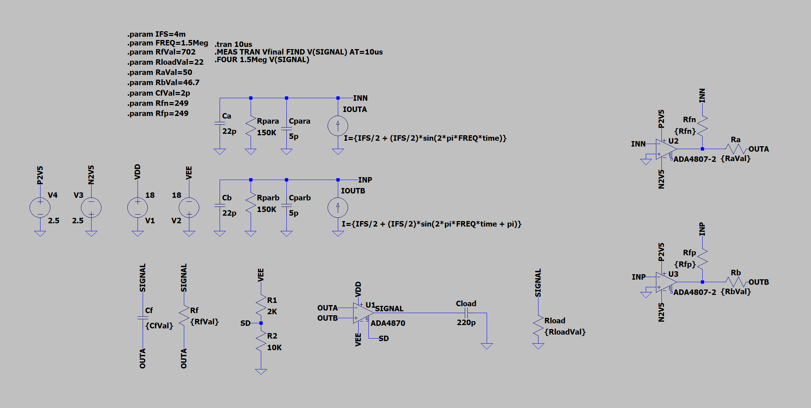
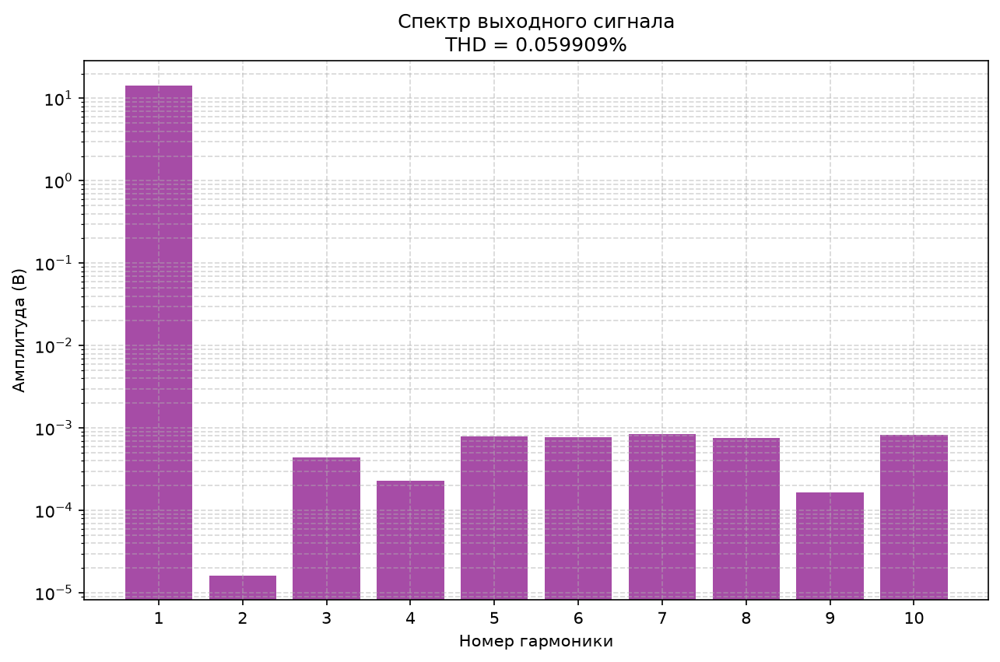
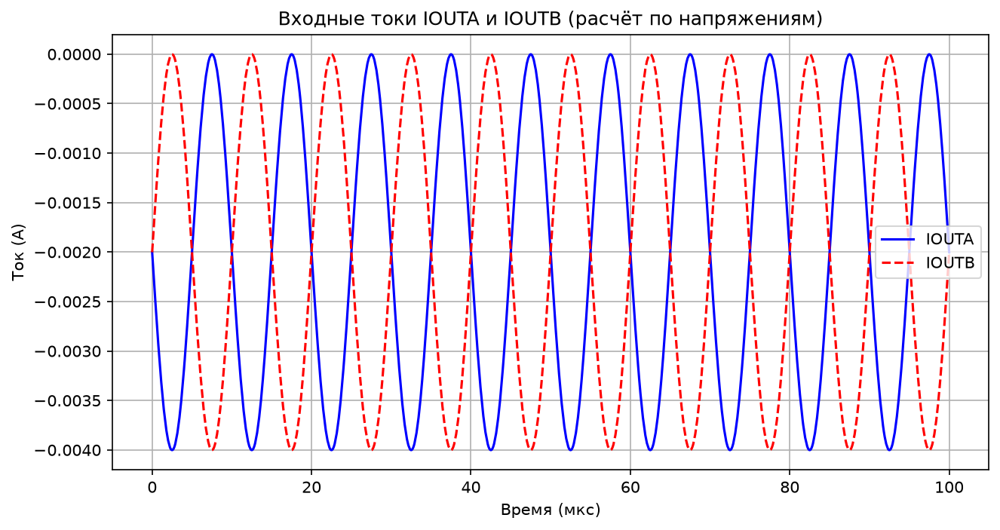
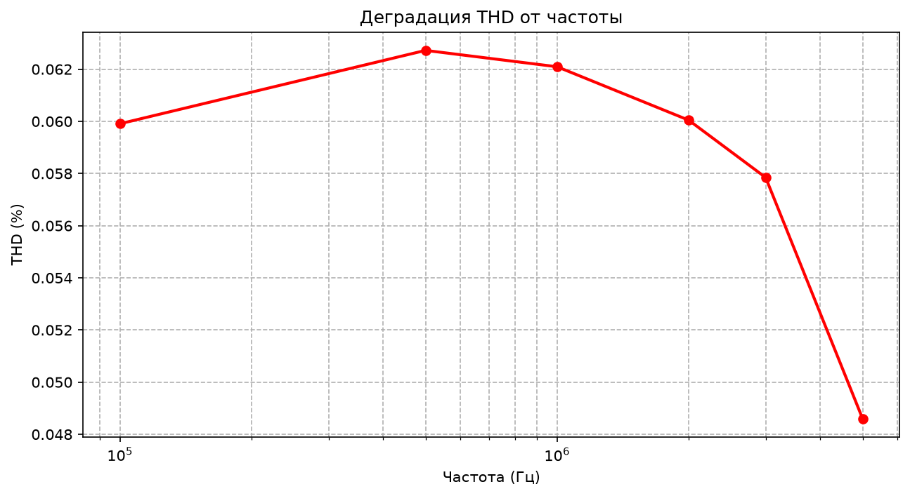

# ADASim — расчёт и симуляция тракта AD9705 → ADA4807-2 → ADA4870

Инструмент для подбора номиналов и проверки в LTspice выходного каскада
генератора синусоподобного сигнала: DAC (AD9705) → трансимпедансный
каскад (ADA4807-2) → мощный буфер тока (ADA4870). Используется в проекте
HiPIMS-генератора анодного драйвера (лаборатория МФ МГТУ им. Баумана).

## Зачем это нужно

Есть три конкретные задачи, которые руками делать долго и легко ошибиться:

1. **Подобрать номиналы Ra/Rf/Rb/Cf** под целевую амплитуду и ток нагрузки,
   с округлением до реального ряда E96 — так, чтобы не считать это каждый раз
   заново в блокноте.
2. **Прогнать реальную симуляцию в LTspice** с этими номиналами и вытащить
   THD, форму сигнала, спектр гармоник — не открывая GUI руками на каждый
   вариант.
3. **Разобрать саму схему (.asc)** и получить читаемый список "какой пин
   какого компонента к какой цепи подключён" — без ручной трассировки
   координат проводов, которая уже не раз приводила к ошибочным выводам
   (см. раздел "Асимметрия коэффициента усиления" ниже — там же история,
   как её один раз неправильно продиагностировали именно из-за отсутствия
   такого инструмента).

## Что тракт вообще делает

```
AD9705 (DAC, комплементарные токовые выходы IOUTA/IOUTB)
        │
        ▼
ADA4807-2 × 2 (TIA — трансимпедансный каскад, ток → напряжение)
   Rfn/Rfp = R_TIA — задают трансимпеданс (сейчас 249 Ом = R17/R18 на плате)
        │
        ▼  (дифференциальное напряжение OUTA/OUTB)
Ra/Rb/Rf/Cf — согласующая сеть на входах ADA4870
        │
        ▼
ADA4870 (мощный буфер, ±18В, до 1А выходного тока)
        │
        ▼
SIGNAL → нагрузка (Rload = 22 Ом = R23 на плате)
```

Целевые параметры (см. `config.yaml` → `params`): амплитуда на выходе
~14В, нагрузка 22 Ом (пиковый ток ~0.6А), питание ±18В.

## Асимметрия коэффициента усиления между плечами (~6-7%)

**Наблюдение:** и в симуляции, и на реальной плате положительный и
отрицательный пик выходного сигнала не равны по модулю (например, +13.7В
против −14.9В при Ra=150Ω/Rf=2100Ω).

**Почему это НЕ баг подбора номиналов.** `calculation.py` считает
`Rb = Ra·Rf/(Ra+Rf)` — это классическая формула согласования входных
токов смещения (bias current matching): она уравнивает постоянно-точное
сопротивление, которое видит каждый вход ОУ, и тем самым убирает офсет от
input bias current. Она **не участвует** в AC-контуре усиления и не может
исправить разницу коэффициентов между плечами.

**Откуда разница на самом деле.** У схемы один резистор обратной связи
(`Rf`) на инвертирующем входе ADA4870, и последовательное включение
неинвертирующего входа через `Rb` (без резистора-шунта на землю).
Коэффициенты передачи для такой топологии:

```
A_v(инв.)   = -Rf/Ra
A_v(неинв.) = 1 + Rf/Ra
```

Разница между ними всегда равна ровно **1** по модулю — это топологическое
свойство схемы с одним резистором ОС, не зависящее от конкретных значений
Ra/Rf/Rb. При целевом A_v≈14 расхождение (14 против 15, условно) даёт те
самые наблюдаемые ~6-7%.

**Статус:** признано в пределах допуска для задачи (запас до шины питания
±16В при целевой амплитуде 14В — далеко от клиппинга что вверх, что вниз)
и осознанно не компенсируется. Если понадобится компенсировать в будущем —
делать через смещение целевого `A_v` (фактически — целиться не в 14В
строго, а в середину между будущими +/- пиками), а не через игру с Ra/Rb,
которые для этого не предназначены и физически не могут на это повлиять.

**История ошибки, если интересно, как до этого дошли:** на первых порах при
ручной трассировке `.asc` координатами резистор `Rb` был принят за резистор
"в воздухе" (обрыв) из-за аномально малого тока в CSV (~9мкА против ~6.6мА
у `Ra`). Оказалось, это не обрыв, а нормальное поведение — `Rb` действительно
последовательный резистор, но в цепь высокоомного неинвертирующего входа,
куда током смещения течёт единицы мкА по определению, в отличие от `Ra`,
который сидит в цепи низкоомного суммирующего узла (инв. вход + `Rf`).
Именно эта путаница и стала поводом написать нормальный автоматический
разбор схемы вместо ручной трассировки координат — см. `ltspice_io/`.

## Установка

```bash
pip install -r requirements.txt
```

Требуется LTspice (путь к `.exe` — в `config.yaml` → `ltspice.executable`).

## Использование

```bash
python main.py
```

Всё конфигурируется через `config.yaml`:

- `params` — целевые параметры тракта (амплитуда, ток, R_TIA, диапазон Ra)
- `frequencies` — сетка частот для прогона деградации THD
- `plots` — какие графики строить и сохранять ли в файл (`save`/`show`)
- `schematic.symbol_search_paths` — где искать `.asy` символы (см. ниже)

Результаты — в `images/` (графики, `report.txt`, CSV) и `net/` (читаемый отчёт
по схеме).

## Параметры конфигурации (`config.yaml`)

### `schematic`
| Параметр | Назначение |
|---|---|
| `path` | Путь к файлу схемы `.asc` |
| `symbol_search_paths` | Список директорий, где искать `.asy` для каждого символа из схемы (и кастомные, типа `OpAmps\ADA4870`, и штатные примитивы `res`/`cap`/`voltage`/`bi`). Обязательно должен включать папку с кастомными символами проекта; штатные примитивы обычно лежат в `<LTspice>\lib\sym` |

### `ltspice`
| Параметр | Назначение |
|---|---|
| `executable` | Путь к `LTspice.exe`, нужен для запуска симуляции через `PyLTSpice` |

### `simulation`
| Параметр | Назначение |
|---|---|
| `output_dir` | Куда складывать CSV/графики/отчёт (по умолчанию `./out`) |
| `temp_dir` | Рабочая папка для `.raw`/`.log` от LTspice (по умолчанию `./temp`) |

### `params` — исходные данные для расчёта номиналов
| Параметр | Назначение |
|---|---|
| `I_FS` | Полный ток DAC, А. Для AD9705 задаётся резистором `R19` (`DAC_FS_ADJ`) на плате |
| `R_TIA` | Трансимпеданс TIA-каскада, Ом. На плате — `R17`/`R18` |
| `V_out_amp` | Целевая амплитуда на выходе ADA4870, В |
| `R_load` | Сопротивление нагрузки, Ом. На плате — `R23` |
| `V_sup` | Питание ADA4870 (симметричное, ±), В |
| `V_headroom` | Требуемый запас до шины питания при максимальной амплитуде, В |
| `I_out_max` | Максимально допустимый выходной ток ADA4870 по даташиту, А |
| `Rf_max` | Верхний потолок для `Rf` при переборе — отсекает нереалистичные комбинации |
| `Ra_candidates` | Список номиналов `Ra` (обычно из ряда E96/E24), которые перебираются при подборе |
| `C_in_parasitic` | Паразитная входная ёмкость ADA4870 (по даташиту), используется для расчёта компенсирующей `Cf` |
| `Rf_target` | Желаемое значение `Rf` "для красоты"/повторяемости между ревизиями — используется только как критерий сортировки готовых вариантов, не как ограничение |

### `frequencies`
Список частот (Гц), на которых прогоняется THD при `plots.degradation: true`
(см. `degradation_sweep` в `runner.py`).

### `tran_settings`
| Параметр | Назначение |
|---|---|
| `periods_transient` | Сколько периодов сигнала "прогреть" перед тем, как начать сохранять данные (переходный процесс) |
| `periods_analysis` | Сколько периодов после прогрева реально сохранять и анализировать |
| `points_per_period` | Плотность точек на период — влияет и на точность Фурье-анализа, и на размер `.raw`/CSV |

### `plots`
| Параметр | Назначение |
|---|---|
| `time_domain` / `spectrum` / `degradation` / `input_currents` | Какие графики строить (см. `report/plotting.py`) |
| `save` | Сохранять ли графики в файлы в `output_dir` |
| `show` | Показывать ли графики в интерактивном окне (`plt.show()`) — обычно `false` при автоматических прогонах, иначе блокирует выполнение на каждом графике |

### `netlist_generator`
| Параметр | Назначение |
|---|---|
| `generate_netlist` | Строить ли читаемый отчёт по схеме (`ltspice_io/readable_report.py`) |
| `output_dir` | Куда сохранять `*_readable.txt` (по умолчанию `./net`) |

### `ac_analysis`
Зарезервировано под будущий AC-свип (`freq_start`/`freq_stop`/
`points_per_decade`) — на момент написания README ещё не подключено ни к
одному прогону в `main.py`, но параметры уже читаются из конфига для
будущего использования.

## Как считаются номиналы (алгоритм `core/calculation.py`)

Расчёт идёт в `select_components()` в несколько шагов:

1. **Проверка ограничений по питанию.** Если запрошенная `V_out_amp`
   превышает `|V_sup| − V_headroom` (то есть не влезает в шину с нужным
   запасом), амплитуда автоматически урезается до максимально возможной, и
   в лог пишется предупреждение — расчёт не падает, а подстраивается.

2. **Проверка ограничения по току.** Пиковый ток `V_out_amp / R_load`
   сравнивается с `I_out_max`; если превышен — это уже не подстраивается
   автоматически, а кидается `ValueError` (в отличие от превышения по
   напряжению, превышение по току считается более серьёзной ошибкой,
   способной физически повредить ADA4870, поэтому расчёт не пытается
   угадать "безопасное" значение сам).

3. **Расчёт требуемого усиления.** Дифференциальное напряжение на выходе
   TIA `V_diff_amp = I_FS · R_TIA`, требуемое усиление буфера
   `A_v_required = V_out_amp / V_diff_amp`.

4. **Перебор `Ra_candidates`.** Для каждого кандидата `Ra` из конфига:
   - `Rf = A_v_required · Ra` (точное, до округления, значение)
   - округление `Rf` и производного `Rb = Ra·Rf/(Ra+Rf)` до ближайшего
     номинала ряда **E96** (`nearest_e96()` — берёт мантиссу числа,
     ищет ближайшую по абсолютной разнице мантиссу в таблице E96, применяет
     обратно порядок величины)
   - расчёт компенсирующей ёмкости `Cf = C_in_parasitic · (Ra / Rf_e96)` —
     это стандартная компенсация полюса, вносимого входной ёмкостью ADA4870
     совместно с `Rf`
   - кандидаты с `Rf` выше `Rf_max` отбрасываются как нереалистичные

5. **Сортировка результатов.** Каждому варианту считается:
   - `Rb_error_abs` — насколько округление до E96 увело `Rb` от точного
     расчётного значения
   - `Rf_error_rel` — относительное отклонение округлённого `Rf` от
     `Rf_target` (это именно "мягкий" критерий предпочтения, не ограничение)

   Финальная сортировка — сначала по `Rb_error_abs` (точность согласования
   входных токов важнее), затем по `Rf_error_rel` (близость к целевому,
   "привычному" номиналу — вторична). Выбирается первый (лучший) результат.

**Важно про физический смысл `Rb`.** Это согласование входных токов
смещения (`Rb = Ra‖Rf`), а не балансировка коэффициента усиления между
плечами — см. раздел "Асимметрия коэффициента усиления" выше, там же
объяснение, почему на выходе всё равно остаётся постоянная составляющая
смещения порядка `R_TIA·I_FS/2`, которую этот алгоритм принципиально не
устраняет (и не должен — это не его задача).

## Описание схемы (`ada4807_4870.asc`)



Полный автоматически сгенерированный список пинов и цепей — в
`net/ada4807_4870_readable.txt` (см. `ltspice_io/readable_report.py`).
Здесь — смысл каждого блока схемы:

### Источники сигнала (эмуляция DAC)
`IOUTA`/`IOUTB` — поведенческие источники тока (`bi`), эмулирующие
комплементарные токовые выходы AD9705:
```
IOUTA = IFS/2 + (IFS/2)·sin(2π·FREQ·t)
IOUTB = IFS/2 + (IFS/2)·sin(2π·FREQ·t + π)
```
Обратите внимание: сумма `IOUTA + IOUTB = IFS = const` — они не строго
противофазны вокруг нуля, а колеблются вокруг `IFS/2` в противофазе. Именно
это и создаёт постоянную синфазную составляющую тока, которая проявляется
как offset на выходе (см. раздел про симметрию выше).

### TIA-каскад (`U2`, `U3` — ADA4807-2)
Два одинаковых плеча, по одному на каждый ток DAC:
- Неинвертирующий вход (пин 100) — на GND (цепь `0`) для обоих
- Инвертирующий вход (пин 101) — принимает ток от `IOUTA`/`IOUTB` (цепи
  `INN`/`INP`), туда же заведена обратная связь `Rfn`/`Rfp` (= `R_TIA`)
- Выход (пин 104) — узел `N_-656_-144` (канал A) / `N_-656_272` (канал B);
  синтетическое имя, потому что на схеме на этот узел не повешен явный
  `FLAG` — по сути это "просто выход U2/U3", отдельного смыслового имени
  автор схемы ему не давал
- Питание — ±2.5В (`P2V5`/`N2V5`), отдельное от основного питания
  ADA4870 (±18В) — TIA работает при меньшем размахе

### Согласующая сеть перед ADA4870
- `Ra` — от выхода `U2` (`N_-656_-144`) до узла `OUTA` (= инв. вход `U1`)
- `Rb` — от выхода `U3` (`N_-656_272`) до узла `OUTB` (= неинв. вход `U1`)
- `Rf` — обратная связь `U1`: от `SIGNAL` (выход) обратно на `OUTA`
- `Cf` — параллельно `Rf`, компенсация входной ёмкости `U1`

### Буфер тока (`U1` — ADA4870)
Пины (см. `PINATTR PinName` в `ADA4870.asy` — числовые условные имена,
не буквенные):
| Пин | Имя цепи | Назначение |
|---|---|---|
| 100 | `OUTB` | Неинвертирующий вход |
| 101 | `OUTA` | Инвертирующий вход |
| 102 | `VDD` | +18В |
| 103 | `VEE` | −18В |
| 104 | `SIGNAL` | Выход |
| 106 | `SD` | Управление (см. `R1`/`R2` — делитель, задающий постоянное смещение на этом пине; в железе вместо резистивного делителя используется компаратор с гистерезисом на LM311, эта часть схемы в LTspice-модели упрощена) |

### Нагрузка
`Rload` (= целевое `R_load` из конфига) и `Cload` — от `SIGNAL` на землю,
имитация реальной нагрузки тракта.

## Из чего состоит `report.txt` и зачем

Генерируется `report/text_report.py`, секции сверху вниз:

1. **Исходные параметры** — прямое эхо того, что задано в `config.yaml →
   params`, чтобы отчёт был самодостаточным (не нужно смотреть в конфиг
   отдельно, если результат обсуждается позже без него под рукой).

2. **Результаты расчёта** — `V_diff_amp` и требуемое усиление `A_v` до
   округления до E96. Нужны, чтобы проверить, не "уехал" ли итоговый
   `A_v_real` слишком далеко от идеального из-за округления.

3. **Подобранные номиналы** — итоговые `Ra`/`Rf`/`Rb`/`Cf`, и точный
   расчёт, и округлённый (E96). Разница между ними — тот самый
   `Rb_error_abs`/`Rf_error_rel`, по которым шла сортировка вариантов
   (см. алгоритм выше); если она велика — стоит проверить, нет ли в
   `Ra_candidates` кандидата, дающего меньшую ошибку.

4. **Проверка** — `A_v_real` (уже с округлёнными номиналами), ожидаемая
   амплитуда на выходе и пиковый ток нагрузки. Это то, что стоит сверять
   с реальной формой сигнала на графике `time_domain.png` — если
   расходится сильнее пары процентов, что-то не так уже не в расчёте, а
   в самой схеме/симуляции.

5. **Известная особенность топологии** — короткая версия раздела про
   асимметрию из этого README, чтобы она попадалась на глаза при каждом
   прогоне, а не только при чтении документации отдельно.

6. **Результаты симуляции** — THD на первой (референсной) частоте из
   `frequencies`. Полный свип по всем частотам — отдельно в
   `thd_vs_freq.csv`, в `report.txt` попадает только одна точка, чтобы
   отчёт оставался коротким и читаемым за один взгляд.

7. **Файлы** — пути ко всем сопутствующим артефактам (CSV, лог LTspice,
   читаемый отчёт по схеме) для быстрой навигации, если `report.txt`
   пересылается отдельно от остальной папки `images/`.

## Описание графиков (`report/plotting.py`)

Все четыре строятся из одного и того же CSV (`ada4870_raw_export.csv`),
кроме `degradation.png`, который строится по отдельному свипу.

### `time_domain.png` — `plot_time_domain()`
Два графика друг под другом: `V(signal)` (выходное напряжение) сверху,
`I(Rload)` (ток нагрузки) снизу, по общей оси времени. Основное назначение —
визуально проверить форму сигнала: нет ли клиппинга по шинам питания, нет ли
видимых на глаз искажений формы, и сверить пиковые значения с тем, что
предсказано в `report.txt` (`A_v_real`, ожидаемая амплитуда). Именно здесь
видна асимметрия +/- пиков, о которой отдельный разговор в разделе про
асимметрию выше.


### `spectrum.png` — `plot_spectrum()`
Столбчатая диаграмма амплитуд первых 10 гармоник (лог. шкала по Y),
данные — из блока `.four` в логе LTspice. В заголовке дублируется THD.
Назначение — увидеть, какие именно гармоники дают основной вклад в
искажения: чётные гармоники (2, 4, 6...) обычно указывают на асимметрию
сигнала (несимметричный перекос формы), нечётные (3, 5, 7...) — на
симметричное ограничение/компрессию (например, приближение к клиппингу).
На практике у нас основной вклад дают именно нечётные — то есть источник
искажений не тот же самый эффект, что даёт офсет/асимметрию пиков, это два
разных, не связанных друг с другом явления.



### `input_currents.png` — `plot_input_currents()`
Токи `IOUTA`/`IOUTB`, восстановленные обратным пересчётом из напряжений на
резисторах TIA (`(V(n001)-V(inn))/R_TIA`) — то есть не измеренные напрямую,
а вычисленные. Назначение — убедиться, что поведенческие источники тока
DAC действительно ведут себя так, как задумано (комплементарные, с общим
смещением IFS/2, без неожиданных выбросов) до того, как разбираться в
искажениях дальше по тракту — если проблема уже видна здесь, дальше по
цепи её точно не найти.



### `degradation.png` — `plot_degradation()`
THD (%) в зависимости от частоты (лог. шкала по X), одна точка на каждую
частоту из `frequencies` в конфиге. Строится отдельным прогоном
(`degradation_sweep()` в `runner.py`), а не из одного CSV — каждая точка
это отдельный запуск LTspice на своей частоте. Назначение — убедиться, что
искажения не растут неприемлемо на верхней границе рабочего диапазона.
Важно: THD не показывает офсет/асимметрию пиков (это "нулевая гармоника",
в расчёт `.four` не входит) — для контроля симметрии по частоте этот график
не подходит, нужно отдельно смотреть `V(signal).min()/max()` на каждой
частоте (см. раздел про асимметрию выше, там же оговорка, что это пока не
реализовано).



## Архитектура

```
adasim/
├── core/                    # Чистая логика, БЕЗ побочных эффектов и I/O
│   ├── calculation.py        # Подбор Ra/Rf/Rb/Cf, округление E96
│   └── constants.py          # Ряд E96
│
├── ltspice_io/               # Всё, что читает файлы LTspice и запускает симулятор
│   ├── asy_parser.py          # Разбор .asy (координаты + имена пинов символа)
│   ├── asc_parser.py          # Разбор .asc (WIRE/FLAG/SYMBOL → граф цепей)
│   ├── readable_report.py     # Человекочитаемый отчёт по схеме (из asc_parser)
│   └── runner.py              # LTspiceRunner — subprocess, .raw/.log, THD/Фурье
│
├── report/                   # Представление результатов
│   ├── plotting.py            # Графики (сохранение в файл, опционально show())
│   └── text_report.py         # Текстовый report.txt
│
├── config.py                 # Загрузка YAML-конфига
├── config.yaml
├── logger_config.py           # Логгер 'ADASim', не менялся при рефакторинге
├── main.py                    # Только оркестрация вызовов, без логики
├── docs/known_issues.md       # Подробности по асимметрии и подводным камням
└── requirements.txt
```

**Принцип разделения:** `core/` не знает о существовании LTspice вообще —
это чистые функции от `params: dict` к номиналам, их можно тестировать без
единого файла `.asc`. `ltspice_io/` наоборот — весь код, работающий с
файлами LTspice (символы, схемы, netlist, запуск симулятора), ничего не
знает про то, как выбираются номиналы. `report/` только рисует и
форматирует то, что ему передали, не принимает решений о значениях.
`main.py` связывает всё вместе и должен оставаться тонким — если в нём
появляется реальная логика (не вызов чужой функции), это сигнал, что она
должна переехать в `core/` или `ltspice_io/`.

### Почему `.asc` разбирается сам, а не через `LTspice -netlist`

Старый подход — гонять `LTspice -netlist` и парсить получившийся `.net` —
даёт вместо имён пинов (`IN+`, `OUT`, `SD`) голые номера (`pin104`, `pin106`),
а сам числовой формат ExpressPCB-подобной netlist-таблицы плохо
документирован и его пришлось реверсить вручную. `asc_parser.py` читает
исходный `.asc` напрямую и берёт настоящие имена пинов из `.asy` — тот же
уровень детализации, что видно в самом LTspice при наведении на пин, но
автоматически и для всей схемы сразу.

### Кодировка `.asy`-файлов

Разные `.asy` встречаются и в UTF-16LE (обычно — кастомные символы, которые
LTspice сохраняет сам через GUI), и в обычном ASCII/UTF-8 (штатные примитивы
вроде `res.asy`). `asy_parser.py` определяет кодировку по содержимому (BOM,
затем доля нулевых байт), а не перебором с расчётом на исключение — обычный
ASCII-файл почти всегда "успешно", но неверно, декодируется как UTF-16LE,
поэтому расчёт на `UnicodeDecodeError` как индикатор ошибки здесь не работает.

### Известные ограничения

Полный список — в [`docs/known_issues.md`](docs/known_issues.md): помимо
асимметрии коэффициента усиления, там же — про то, что `.param` внутри
самого `.asc` не источник истины (их всегда подменяет `runner.py` перед
запуском), и общая заметка про кодировки `.asy`.
